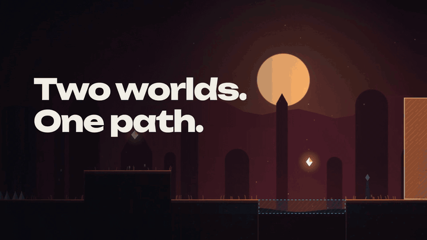

<div align="center">

# Dusklight

### [▶ Play in your browser](https://robinsp5.github.io/dusklight/)

**[robinsp5.github.io/dusklight](https://robinsp5.github.io/dusklight/)** · free, no install, works with keyboard, gamepad and touch

<br>

<a href="https://robinsp5.github.io/dusklight/trailer.mp4"></a>

[🎬 Watch the full trailer with sound (22s)](https://robinsp5.github.io/dusklight/trailer.mp4)

</div>

A 2D platformer between two worlds. Ember platforms are only solid in Ember, Frost platforms only in Frost. Switch worlds (even mid-jump) to make your path appear.

## Run

```bash
npm start            # node server.mjs (no-cache dev server on port 5173)
# then open http://localhost:5173
```

No build step: plain ES modules, Canvas 2D and WebAudio.

## Controls

| Action | Keyboard | Gamepad |
|---|---|---|
| Move | A/D or ←/→ | Left stick / D-pad |
| Jump (hold to jump higher) | Space, W, ↑ | A |
| Dash (once per jump) | X, K | X / RT |
| Switch world | Shift, J, C | B / Y / RB |
| Pause / resume | Esc, P | Start |
| Restart level / mute | R / M | |

On first launch an animated tutorial shows each move as a live, scripted game scene (replay it from Settings). Touch devices get on-screen buttons and a touch version of the tutorial. Every key can be rebound in Settings (Esc always pauses), and a gamepad can drive the menus too.

## Progress

- **Stars:** three per level: beat the par time, find every shard, finish without dying.
- **Ghost:** after a new best time, a translucent replay of that run races you on your next attempt (toggle in Settings).
- **Shards are a currency:** every run pays out (shards collected, level cleared, first clear, new stars, new best time, no deaths, every shard). The level-complete screen counts it up and shows your progress towards a goal.
- **Shop:** 42 cosmetics in six slots (body, scarf, accessory, trail, death effect, colour theme) and four tiers. Try anything on before you buy it, pin an item as your goal. The legendary items (Prism, Supernova, Phoenix, Orbit, Prism Ribbon, Neon Night, Gold & Void) are animated and take a few playthroughs to afford. No loot boxes, no randomness; colour cycles are smooth, without flashing.
- **Death map:** the level select marks where you died most often. The in-game **Settings** page lists every control and has master, music and effects volume, mute, screen shake, reduced effects, a timer toggle and a progress reset.

## Levels

25 levels in six acts. Difficulty rises with every level (checked by `tests/profile.mjs`) and every level and every shard is proven reachable with the real physics (`tests/solve.mjs`).

| Act | Levels | New idea |
|---|---|---|
| I: Two worlds | 1 Awakening, 2 Tides, 3 Hall of Mirrors, 4 Threshold | switching worlds, dash, springs, one-way platforms |
| II: Thorns | 5 Thorn Hall, 6 Flux, 7 Star Leap, 8 Zenith | hanging spikes, phase spikes that only hurt in their own world |
| III: Crumble | 9 Brittle Crossing, 10 Sinking Viaduct, 11 Crumbling Cathedral, 12 Collapse | crumbling stone that breaks under your feet |
| IV: Sparks | 13 First Sparks, 14 Lantern Bridge, 15 Updraft, 16 Needle Run, 17 Chainlight | dash orbs that recharge your dash in mid-air |
| V: Pulse | 18 Metronome, 19 Tide Clock, 20 Breathing Walls, 21 Crescendo | the world switches on its own, on the beat |
| VI: Beyond | 22 Brittle Sky, 23 Needle's Eye, 24 Heartbeat, 25 Dusklight | everything combined, the finale |

## Structure

- `src/world.js` – pure simulation (fixed 120 Hz step, coyote time, jump buffer, dash, springs, one-way platforms, phase collision)
- `src/level-kit.js` – tile legend and level builder; `src/levels.js` (acts I-II) and `src/levels-act3.js` … `levels-act6.js`
- `src/render.js` – procedural parallax backdrop, world colour blend, particles, scarf physics
- `src/audio.js` – synthesised effects and an ambient pad on separate music and effects buses
- `src/settings.js` – persisted player settings
- `src/progress.js` – stars, ghost encoding and the death log (pure, unit-tested)
- `src/shop.js` – shop catalog, earnings, buying, goals, save migration (pure, unit-tested)
- `src/cosmetics.js` – colour themes and the drawing of bodies, scarves, accessories, trails and death effects
- `src/demo-player.js` – plays scripted demo scenes for the tutorial and the wardrobe preview
- `src/demos.js` – scripted tutorial scenes running on the real simulation
- `src/main.js` – state machine, UI, camera, save data (localStorage)

## Tests

```bash
npm test                # unit tests, fairness check, tutorial demos, solver
npm run solve           # solver: every level is finishable and every shard reachable, using the real physics
node tests/profile.mjs  # difficulty profile: deadly columns, hazards, landing widths, checkpoint spacing
node tests/fairness.mjs # no hanging spike may decide a full jump by only a few pixels
```

## Deploy

Pushing to `main` deploys to GitHub Pages via `.github/workflows/pages.yml`. The workflow copies only the game files (`index.html`, `styles.css`, `src/`) and replaces `__V__` with the commit hash, so every release gets fresh, consistent URLs. When you add a module to `src/`, list it in the import map in `index.html` (`node tests/importmap.mjs` checks this).

## Credits

- Trailer music: "Happy Beats / Business Moves Vol. 12" by [ENDE.APP](https://ende.app/en), licensed [CC BY 4.0](https://ende.app/en/standard-license)
- Trailer sound effects: [Kenney](https://kenney.nl/) (CC0)
- Fonts: Unbounded, Outfit, JetBrains Mono (SIL Open Font License), self-hosted
- Icons: [Phosphor Icons](https://phosphoricons.com/) (MIT), self-hosted
- Trailer footage is real gameplay, recorded from the game canvas and edited with [HyperFrames](https://hyperframes.heygen.com/)
